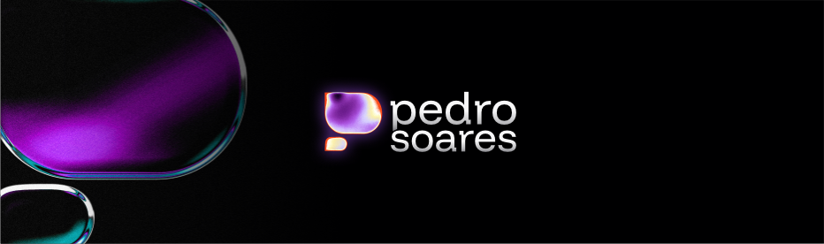
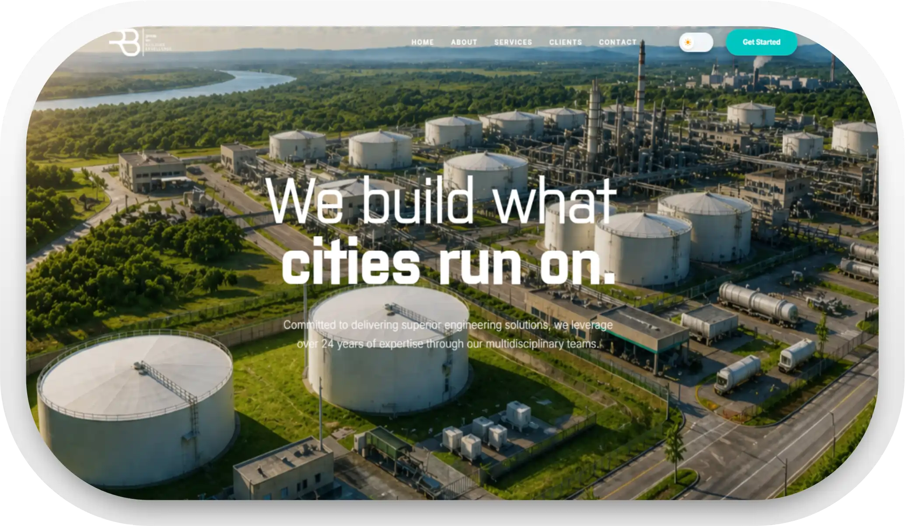
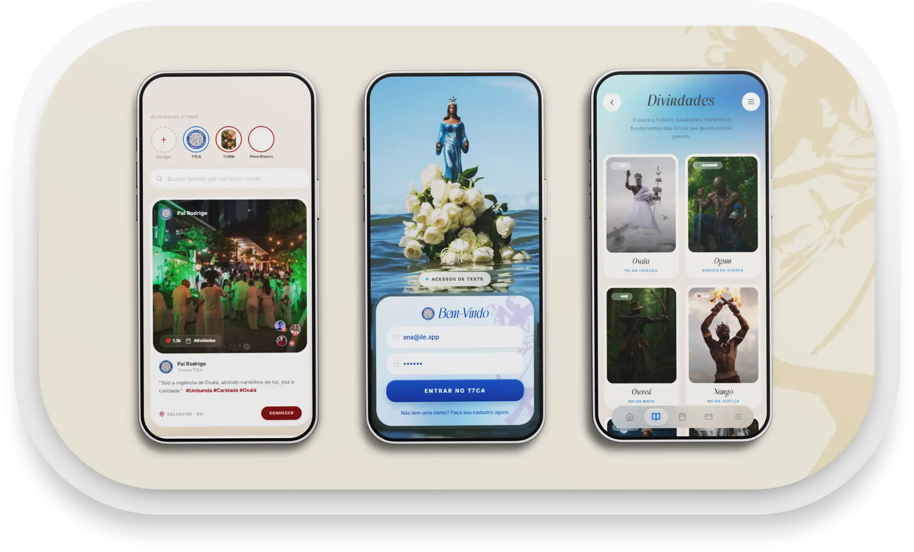
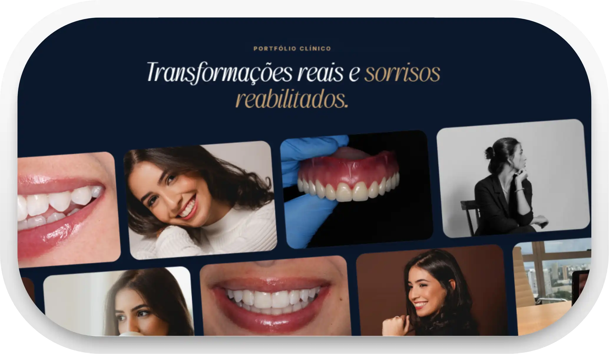
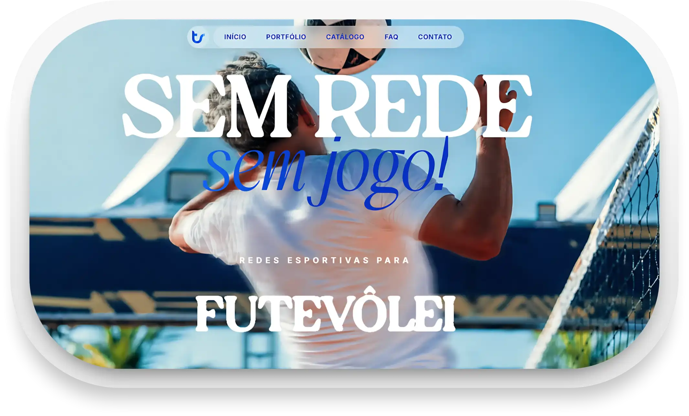

  

  <strong>Desenvolvedor Front-end & UI/UX Designer</strong> 
  Criando interfaces modernas, intuitivas e de alto desempenho que unem engenharia de software e design de experiência do usuário.

---

### 🌐 Sobre Mim

Olá! Sou o Pedro Soares. Sou formado em **Análise e Desenvolvimento de Sistemas (ADS)** e atualmente graduando em **Ciência da Computação**. Minha atuação profissional é focada no desenvolvimento frontend e design de interfaces, criando produtos digitais que alinham excelente usabilidade a um código limpo e performático.

- **Atuação:** Desenvolvimento de sistemas web complexos, modernização de interfaces legado, otimização de performance frontend e desenvolvimento de landing pages de alta conversão.
- **Experiência:** Desenvolvimento de sistemas internos e governamentais no setor público, projetos freelance e soluções digitais ponta a ponta.
- **Diferencial:** Domínio completo do fluxo de design (UI/UX no Figma e Adobe Suite) integrado à implementação técnica ágil e componentizada (React, TypeScript, Tailwind CSS).

---

### 🛠️ Stacks & Competências

| Categoria | Tecnologias & Ferramentas |
| :--- | :--- |
| **Frontend & Mobile** |        |
| **Backend & Banco de Dados** |      |
| **Design & UI/UX** |       |
| **Outros & Ferramentas** |   |

---

### 🚀 Projetos em Destaque

<table width="100%">
  <tr>
    <td width="50%" valign="top">
      
       
      <h3>RB Group</h3>
      
Redesign completo e modernização institucional da presença digital da R+B Group, Inc. (Houston, Texas). Foco em autoridade corporativa e infraestrutura hídrica municipal.

      <a href="https://pedrosoares0.github.io/RBgroup/">Demo</a> | <a href="https://github.com/pedrosoares0/RBgroup">Repositório</a>
    </td>
    <td width="50%" valign="top">
      
       
      <h3>Ilê Webapp</h3>
      
Plataforma para gestão interna de templos religiosos (Umbanda/Candomblé). Centraliza fluxo financeiro, calendário litúrgico interativo e biblioteca integrada.

      <a href="https://github.com/pedrosoares0/ile-webapp">Repositório</a>
    </td>
  </tr>
  <tr>
    <td width="50%" valign="top">
      
       
      <h3>Dra. Laura</h3>
      
Landing page odontológica de alta conversão. Interface moderna e limpa, com arquitetura voltada para autoridade profissional e captação/agendamento de pacientes.

      <a href="https://pedrosoares0.github.io/dra.laura/">Demo</a> | <a href="https://github.com/pedrosoares0/dra.laura">Repositório</a>
    </td>
    <td width="50%" valign="top">
      
       
      <h3>Toinho Redes</h3>
      
Landing page promocional e institucional desenvolvida para fabricante de redes esportivas personalizadas na Bahia. Otimizada para SEO local e captação de leads via mobile.

      <a href="https://pedrosoares0.github.io/toinho-redes-landing/">Demo</a> | <a href="https://github.com/pedrosoares0/toinho-redes-landing">Repositório</a>
    </td>
  </tr>
</table>

---

  
  
  
  

