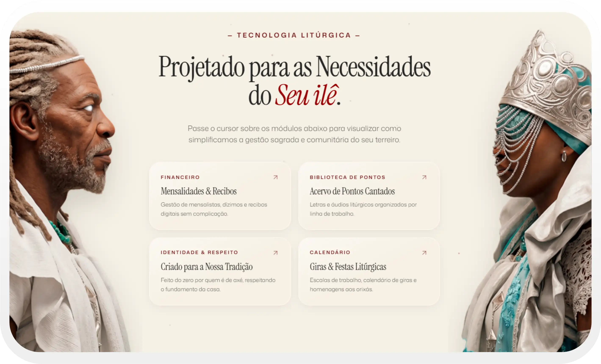
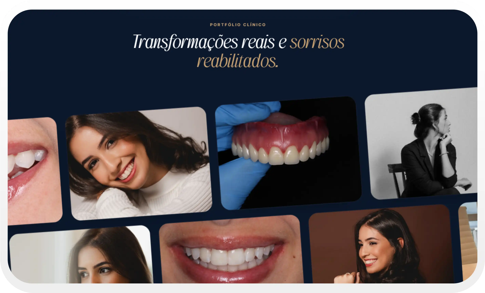

  

  <strong>Front-end Developer & UI/UX Designer</strong> 
  Interfaces com direção de arte, movimento e arquitetura de produto — do conceito visual ao código em produção.

  <a href="https://www.linkedin.com/in/pedro-soares-6144b0328/">LinkedIn</a>
  &nbsp;·&nbsp;
  <a href="mailto:pedrosoaress365@gmail.com">Email</a>
  &nbsp;·&nbsp;
  <a href="https://wa.me/5571993217001">WhatsApp</a>

 

  
  &nbsp;
  

  
  &nbsp;
  

  
  &nbsp;
  

 

###### PROJETOS SELECIONADOS

- **`01`** &nbsp; [**ilê**](https://ileapp.netlify.app/) — Plataforma web para gestão financeira, calendário litúrgico e acervo de terreiros. &nbsp; <a href="https://ileapp.netlify.app/">Live ↗</a> · <a href="https://github.com/pedrosoares0/ile-webapp">Repositório</a>
- **`02`** &nbsp; [**Bruska Pizza Club**](https://bruska.netlify.app/) — Direção de arte e experiência interativa para o primeiro soft club de Salvador. &nbsp; <a href="https://bruska.netlify.app/">Live ↗</a> · <a href="https://github.com/pedrosoares0/bruska">Repositório</a>
- **`03`** &nbsp; [**Toinho Redes**](https://toinho.netlify.app/) — Landing page comercial com foco em posicionamento de marca e captação mobile. &nbsp; <a href="https://toinho.netlify.app/">Live ↗</a> · <a href="https://github.com/pedrosoares0/toinho-redes-landing">Repositório</a>
- **`04`** &nbsp; [**Dra. Laura Laytynher**](https://dralaura.netlify.app/) — Portfólio clínico e presença digital para reabilitação oral e odontologia estética. &nbsp; <a href="https://dralaura.netlify.app/">Live ↗</a> · <a href="https://github.com/pedrosoares0/dra.laura">Repositório</a>
- **`05`** &nbsp; [**Veredito**](https://overedito.netlify.app/) — Avaliador e curador pessoal de livros que separa qualidade técnica de afinidade. &nbsp; <a href="https://overedito.netlify.app/">Live ↗</a> · <a href="https://github.com/pedrosoares0/livros">Repositório</a>
- **`06`** &nbsp; [**Primus**](https://oprimus.netlify.app/) — SaaS de prontidão operacional, checklists e governança para centros cirúrgicos. &nbsp; <a href="https://oprimus.netlify.app/">Live ↗</a> · <a href="https://github.com/pedrosoares0/primus">Repositório</a>
- **`07`** &nbsp; [**Bolão Copa 2026**](https://bandidosapostados.netlify.app/) — Plataforma mobile-first com placares em tempo real via ESPN e ranking ao vivo. &nbsp; <a href="https://bandidosapostados.netlify.app/">Live ↗</a> · <a href="https://github.com/pedrosoares0/bolao">Repositório</a>

 

###### STACK & COMPETÊNCIAS

- **Front-end & Motion** — `TypeScript` `React` `Next.js` `Tailwind CSS` `GSAP` `Framer Motion` `Vite`
- **Back-end & Dados** — `Node.js` `Express` `Supabase` `MySQL` `Python`
- **Design & Produto** — `Figma` `UI/UX` `Design Systems` `Direção de Arte` `Framer` `Webflow` `Adobe Suite`
